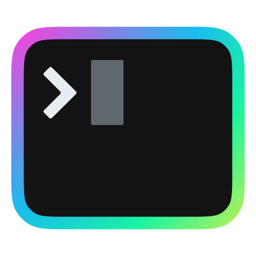

# jspsv.dev

<p align="center">
    
    </a>
</p>

## Run locally

```sh
pnpm install
pnpm run dev # or
pnpm run build
pnpm run preview
```

## TODO

- [ ] Update styling
- [ ] Convert images to .webp during build (while retaining lazy-loading), similar to what [@11ty/eleventy-img](https://www.11ty.dev/docs/plugins/image/) offers.
- [ ] RSS feed
- [ ] Tags with spaces are not supported yet
- [ ] manage node versions using pnpm

## Website metadata

```json
{
  "title": "Joseph Sebastian's website",
  "description": "Joseph Sebastian's website",
  "url": "https://jspsv.github.io/website",
  "lang": "en",
  "locale": "en_us",
  "author": "Joseph Sebastian"
}
```

## Resources

1. [Josh Collinsworth Blog - Let's learn SvelteKit by building a static Markdown blog from scratch](https://joshcollinsworth.com/blog/build-static-sveltekit-markdown-blog)
2. Favicon generated from icons created by [GitHub - covahn](https://github.com/covahn/very-colorful-terminal-icons)
3. Light theme based on [Happy Hues - Palette 6](https://www.happyhues.co/palettes/6).
