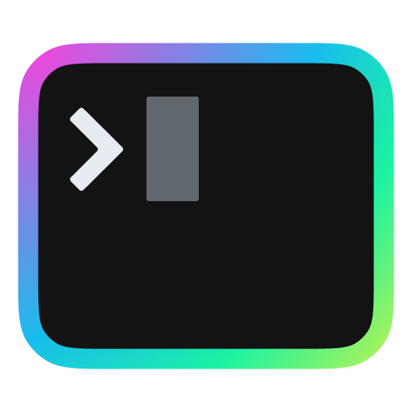

# josephsebastian.me (WIP)

<p align="center">
    
    </a>
</p>

> Note:
>
> 2022-05-19: Migrated from Hugo to 11ty.

## Clone repo

```sh
git clone https://github.com/jspsv/website
```

## Run locally

```sh
# Install dependencies
npm install
# Run development server
npm run dev
# Run production server
npm run build
```

## TODO

- [ ] Update styling
- [ ] Convert images to .webp during build (while retaining lazy-loading), similar to what [@11ty/eleventy-img](https://www.11ty.dev/docs/plugins/image/) offers.
- [ ] RSS feed

## Credits

- Favicon generated from icons created by [GitHub - covahn](https://github.com/covahn/very-colorful-terminal-icons)
- Light theme based on [Happy Hues - Palette 6](https://www.happyhues.co/palettes/6).
