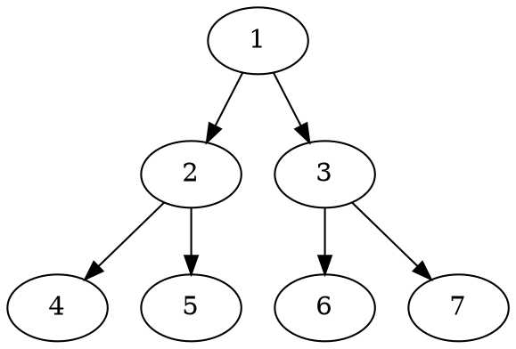

Basic writing and formatting syntax. Create sophisticated formatting for your prose and code on GitHub with simple syntax.

> GFM according to [github](https://docs.github.com/en/get-started/writing-on-github/getting-started-with-writing-and-formatting-on-github/basic-writing-and-formatting-syntax#headings).

<details>
<summary>List of Features</summary>

<!-- TODO: inpage linking fails in sveltekit -->

1. [Headings](#headings)
2. [Styling text](#styling-text)
3. [Quoting text](#quoting-text)
4. [Quoting code](#quoting-code)
5. [Links](#links)
6. [Images](#images)
7. [Lists](#lists)
8. [~~Task Lists~~](#tasks-lists)
9. [Using emoji](#using-emoji)
10. [Footnotes](#footnotes)
11. [Collapsed section](#collapsed-section)
12. [~~Math expressions~~](#math-expressions)
13. [~~Creating digrams~~](#creating-diagrams)

</details>

## Headings

# H1

## H2

### H3

#### H4

##### H5

###### H6

## Styling text

| Style                  | Example                                |
| :--------------------- | :------------------------------------- |
| Bold                   | **This is bold text**                  |
| Italic                 | _This text is italicized_              |
| Strikethrough          | ~~This was mistaken text~~             |
| Bold and nested italic | **This text is _extremely_ important** |
| All bold and italic    | **_All this text is important_**       |
| Subscript              | <sub>This is a subscript text</sub>    |
| Superscript            | <sup>This is a superscript text</sup>  |

## Quoting text

Text that is not a quote

> Text that is a quote

## Quoting code

Use `git status` to list all new or modified files that haven't yet been committed.

Some basic Git commands are:

```shell
git status
git add
git commit
```

The background color should be `#ffffff` for light mode and `#0d1117` for dark mode.

| Style |       Example        |
| :---: | :------------------: |
|  HEX  |      `#0969DA`       |
|  RGB  |  `rgb(9, 105, 218)`  |
|  HSL  | `hsl(212, 92%, 45%)` |

## Links

This site was built using [GitHub pages](https://pages.github.com/).

## Images

<figure>
  
  <figcaption>Fig 1. Octocat</figcaption>
</figure>

## Lists

- George Washington
- John Adams
- Thomas Jefferson
  - First nested list item
    - Second nested list item

1. James Madison
2. James Monroe
3. John Quincy Adams
   1. First nested list item
      1. Second nested list item

## Tasks Lists

- [x] #739
- [ ] https://github.com/octo-org/octo-repo/issues/740
- [ ] Add delight to the experience when all tasks are complete :tada:

- [ ] \(Optional) Open a followup issue

## Using emoji

@octocat :+1: This PR looks great - it's ready to merge! :shipit:

## Footnotes

Here is a simple footnote[^1].

A footnote can also have multiple lines[^2].

You can also use words, to fit your writing style more closely[^note].

[^1]: My reference.
[^2]:
    Every new line should be prefixed with 2 spaces.  
    This allows you to have a footnote with multiple lines.

[^note]:
    Named footnotes will still render with numbers instead of the text but allow easier identification and linking.  
    This footnote also has been made with a different syntax using 4 spaces for new lines.

## Collapsed section

<details>
<summary>Collapsed section</summary>

```ruby
puts "Hello World"
```

</details>

## Math expressions

<!-- - This sentence uses `$` delimiters to show math inline: $\sqrt{3x-1}+(1+x)^2$.
- This expression uses `\$` to display a dollar sign: $\sqrt{\$4}$. -->

- Use `\$` to use `$` sign directly, for example: \$100.

### Writing expressions as blocks

**The Cauchy-Schwarz Inequality**

<!-- $$
\left( \sum_{k=1}^n a_k b_k \right)^2 \leq \left( \sum_{k=1}^n a_k^2 \right) \left( \sum_{k=1}^n b_k^2 \right)
$$ -->

## Creating diagrams


